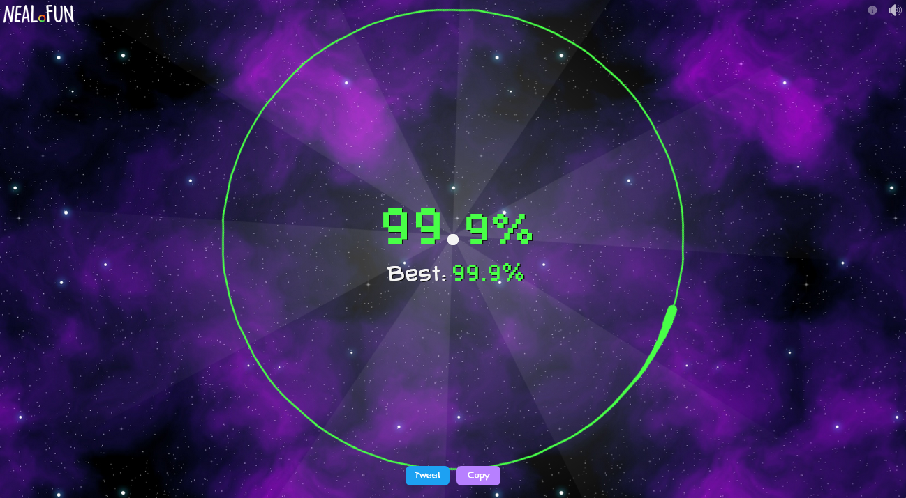

# Perfect_Circle_Bot

Bot to do a perfect circle in [https://neal.fun/perfect-circle/](https://neal.fun/perfect-circle/).

## Usage

1. Install the packages using your package manager of preference.
2. Run the script `perferct_circle_bot.py`.
3. Position your mouse at the exact center of the page, then press Enter to do the circle.
4. Press Esc to end the script.

## Results

## Disclaimer

I've not seen anyone get a 100% so this is the best I'll do, at least for it always gets 99.9%.
